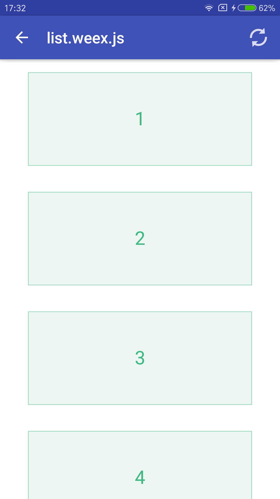

## Weex-Quick-Start
[](https://github.com/zhoukekestar/weex-quick-start)

该项目为Weex的Quick-Start项目，使用过程中如果有更好的样例或者，能把代码解释得更详细的，更清楚的，欢迎提PR，我会尽量merge的^-^. 请先进入[下载页](https://github.com/zhoukekestar/weex-quick-start/releases)下载最新的apk在自己的手机上试试，不行的话，手机兼容可能有点问题，可以的话，就可以大胆尝试了。

## 环境说明
* IDE: Android Studio 2.2.1
* System: Windows 10, 64 bit.
* Gradle: 2.14.1
* [命令日志详情](https://github.com/zhoukekestar/weex-quick-start/blob/master/cmds.md)
```bash
git clone https://github.com/zhoukekestar/weex-quick-start
cd weex-quick-start
gradle build  
// 因为我没有配置gradle命令的路径，所以，实际命令是 "C:\Program Files\Android\Android Studio\gradle\gradle-2.14.1\bin\gradle" build
// 生成的apk在app\build\outputs\apk目录下
// 你也可以直接使用android studio打开该文件夹进行编译
```

## Weex 开发
* `cd weex` 进入weex开发目录
* `npm run build` 编译weex文件至（dist目录和android的assets目录）
* `serve` 开启服务器，（需安装`serve`命令：`npm install serve -g`)
* 打开游览器，并访问`http://localhost:3000/public/`

## 屏幕截屏
| 首页 | 点击跳转后 |
| --- | --- |
|  |  |

## Android Build Details
[Details](https://github.com/zhoukekestar/weex-quick-start/blob/master/HISTORY.md)
